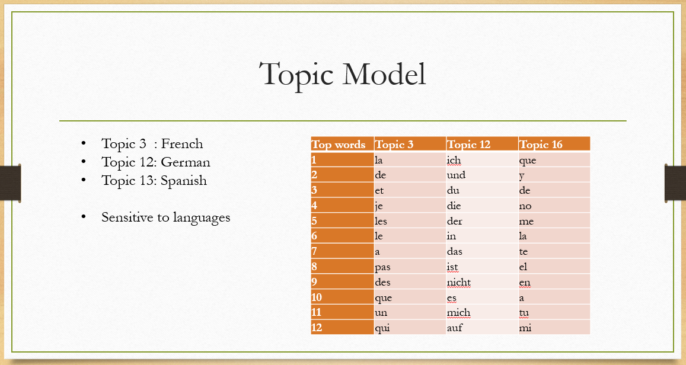

# Project: Words 4 Music

### [Project Description](doc/Project4_desc.md)

Term: Fall 2016

+ [Data link](https://courseworks2.columbia.edu/courses/11849/files/folder/Project_Files?preview=763391)-(**courseworks login required**)

+ [Data description](doc/readme.html)

+ Contributor's name: __Yinxiang Gao__

+ Projec title: __Music and Lyrics__

+ Project summary: In this project we try to predict the occurance of specified words in lyrics given the music features of a song.

----------

## Instruction

### 1. Exploration of data

#### a. Ideas
* Sound features: rhythm, pitch,  timbre, …
* Lyrics:  I, the, you, to, and, …
* There is no apparent relationship between sound features and lyrics.
* We need something in between that connects them. It Could be __lyrics topics__.

#### b. Topic modeling
* Ran latent Dirichlet allocation (LDA) with number of topics equals 20.
* The topics are sensitive to languages.

* We can ignore non-English songs when modeling, in order to reduce complexity.

#### c. Association Rule Mining
* A quick association rule mining on artist tags (just for exploration).
    * Achieved a predictive rank sum of 0.38
    * Worse than baseline model
    * Details under "lib/try1_ARM_on_Tags/""


### 2. Feature engineering

The features of each song is constructed as follows.

* total number of bars in the song
* total number of beats in the song
* total nubmer of segments in the song
* median length of bars in seconds
* median length of beats in seconds
* mean length of segments in seconds
* time signature of the song (how many beats in each bar, which is actually song meter)
* the maximum, minimum, mean, standard error of max loudness of segments (segments_loudness_max)
* mean, sd of segments timbre in the song (both 12 dimensions)
* variation, repeatness of melody
  * melody is obtained by getting the most confident pitch in each segments, see [chroma feature](https://en.wikipedia.org/wiki/Chroma_feature)
  * repeatness is defined as 3 or 4 same pitches in a row.

P.S. Only a part of them are used in the final model.

### 3. Neural network

The final input we use has 38 features for each song.

We run a PCA to reduce the dimension of output (originally the lyrics frequency chart have 5000 columns) to about 100. The PCA can also help us solve problem of sparseness of output matrix, as well as eliminating correlation between dimensions.

Build a single layer neural network with
* __1712__ training observations (first 2000 songs minus songs assigned to non-English topics)
* __300__ test observations (songs 2001-2350 minus songs assigned to non-English topics)
* __38__ input dimensions
* __50__ nodes in Hidden layer 1
* __100__ output dimensions
* max iteration 100
* decay rate 5e-4

Parameters are determined by automatic cross validation.

### 4. Evaluation

Under the evaluation rule of predictive rank sum, we have:

1. random guess
  * predictive rank sum = 1
  * average prediction rank __2500.5__

2. Use total word frequency
  * predictive rank sum = 0.24
  * average prediction rank around __600__

3. Our model
  * predictive rank sum = 0.19
  * average prediction rank around __480__
  
While our model did slightly better than the baseline model, I still don't think that there exists a significant relationship between music features and lyrics, in that 

1. By eliminating the non-English song in both training dataset and test dataset, we merely improved the prediction power on English songs, but left those non-English songs behind. If the relationship between music features and lyrics is universal and strong, language shouldn't make such a big difference.

2. By eliminating the non-English song in both training dataset and test dataset, the performance of baseline model (prediction rank sum using word frequency of English songs only) actually increases to around 480. Therefore our model is just as good as the baseline model, which means that the music features we extracted are not very useful in predicting lyrics.

---------

Following [suggestions](http://nicercode.github.io/blog/2013-04-05-projects/) by [RICH FITZJOHN](http://nicercode.github.io/about/#Team) (@richfitz). This folder is orgarnized as follows.

```
proj/
├── lib/
├── data/
├── doc/
├── figs/
└── output/
```

Please see each subfolder for a README file.
